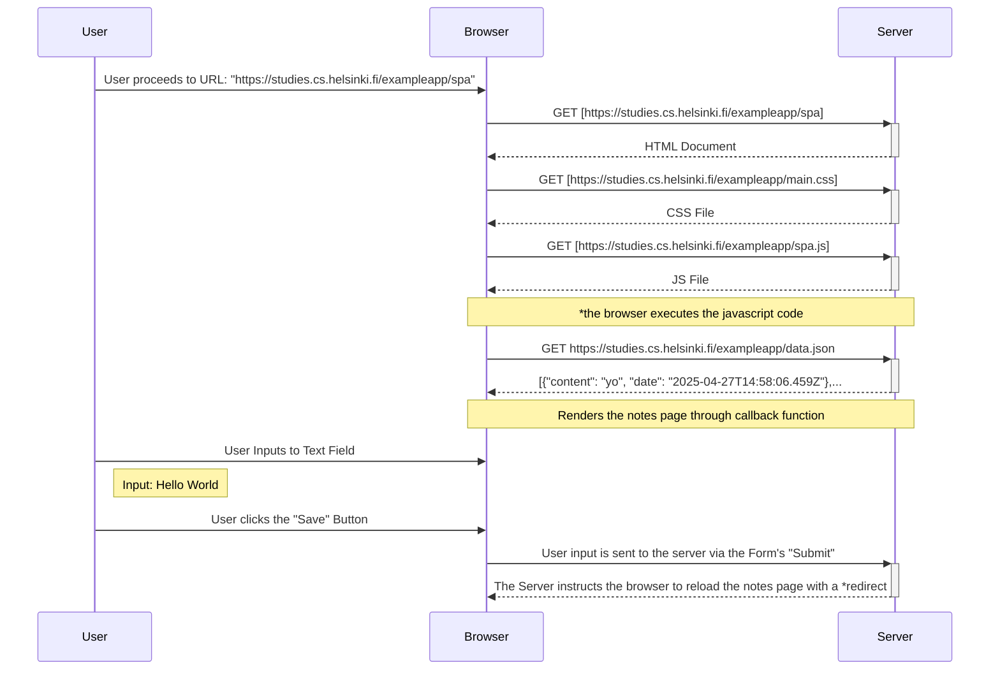

```mermaid
  sequenceDiagram
        participant User
        participant Browser
        participant Server

        %% Exercise 0.5: User gets redirected to the Single Page App

        User->>Browser: User proceeds to URL: "https://studies.cs.helsinki.fi/exampleapp/spa"

        Browser->>+Server: GET [https://studies.cs.helsinki.fi/exampleapp/spa]
        Server-->>-Browser: HTML Document

        Browser->>+Server: GET [https://studies.cs.helsinki.fi/exampleapp/main.css]
        Server-->>-Browser: CSS File

        Browser->>+Server: GET [https://studies.cs.helsinki.fi/exampleapp/spa.js]
        Server-->>-Browser: JS File

        Note over Browser, Server: *the browser executes the javascript code

        Browser->>+Server: GET https://studies.cs.helsinki.fi/exampleapp/data.json
        Server-->>-Browser: [{"content": "yo", "date": "2025-04-27T14:58:06.459Z"},...

        Note over Browser, Server: Renders the notes page through callback function

        %% Exercise 0.6: User creates note in the SPA

        User->>Browser: User Inputs to Text Field
        
        Note right of User: Input: Hello World

        User->>Browser: User clicks the "Save" Button
        Browser->>+Server: User input is sent to the server via the Form's "Submit"
        Server-->>-Browser: The Server instructs the browser to reload the notes page with a *redirect
```
